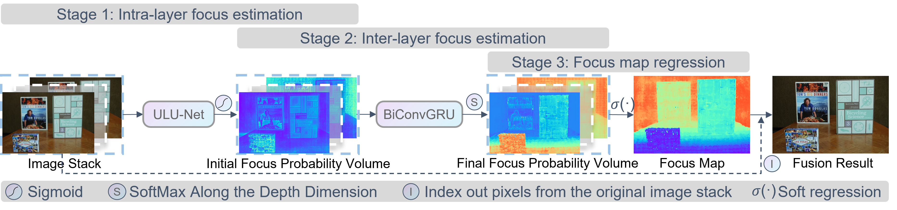

# Rethinking Multi-focus Image Stack Fusion: A Lightweight One-shot Deep Learning Framework via Focal Plane Depth Regression

```
███████╗████████╗ █████╗  ██████╗██╗  ██╗███╗   ███╗███████╗███████╗    ██╗   ██╗██████╗ 
██╔════╝╚══██╔══╝██╔══██╗██╔════╝██║ ██╔╝████╗ ████║██╔════╝██╔════╝    ██║   ██║╚════██╗
███████╗   ██║   ███████║██║     █████╔╝ ██╔████╔██║█████╗  █████╗      ██║   ██║ █████╔╝
╚════██║   ██║   ██╔══██║██║     ██╔═██╗ ██║╚██╔╝██║██╔══╝  ██╔══╝      ╚██╗ ██╔╝██╔═══╝ 
███████║   ██║   ██║  ██║╚██████╗██║  ██╗██║ ╚═╝ ██║██║     ██║          ╚████╔╝ ███████╗
╚══════╝   ╚═╝   ╚═╝  ╚═╝ ╚═════╝╚═╝  ╚═╝╚═╝     ╚═╝╚═╝     ╚═╝           ╚═══╝  ╚══════╝
```

<div align="center">

## 📢 News

> [!NOTE]
> 🎉 **2024.03**: Our StackMFF V1 paper has been accepted by Applied Intelligence (APIN)! Paper link coming soon.

## Authors

**Xinzhe Xie** 👨‍🎓, **Buyu Guo**<sup>✉</sup> 👨‍🏫, **Shuangyan He** 👩‍🏫, **Peiliang Li** 👨‍🏫, **Yanzhen Gu** 👨‍🏫

### Institutions

🏛️ Zhejiang University, Zhoushan, P. R. China  
🏛️ Hainan Institute, Zhejiang University, Sanya, P. R. China  
🔬 Donghai Laboratory, Zhoushan, P. R. China

<sup>✉</sup> Corresponding author

</div>

##  Table of Contents

- [Overview](#-overview)
- [Highlights](#-highlights)
- [Installation](#-installation)
- [Data Preparation](#-data-preparation)
- [Usage](#-usage)
- [Results](#-results)
- [Citation](#-citation)

## 📖 Overview

Most multi-focus image fusion (MFF) networks are designed for two-image fusion, requiring multiple iterative operations for stack fusion that lead to error accumulation and image quality degradation. To address this challenge, we rethink the multi-focus image stack fusion problem by treating image stacks as a unified entity and propose a lightweight one-shot deep learning framework based on focal plane depth regression. The framework consists of three stages: intra-layer focus estimation, inter-layer focus estimation, and focus map regression. By reformulating multi-focus image stack fusion as a focal plane depth regression task, our framework enables end-to-end training using depth maps as proxy supervision. Extensive experiments on five public datasets demonstrate that our framework achieves state-of-the-art performance while reducing model size by 99.2% (from 6.08M to 0.05M parameters) compared to our previous one-shot fusion framework StackMFF, with the lowest FLOPs growth rate as the number of input images increases. Furthermore, our framework can process image stacks of arbitrary size in a single operation while preserving pixel fidelity through direct sampling.

<div align="center">

</div>


<div align="center">

<p>Overview of StackMFF-V2 Framework</p>
</div>

## ✨ Highlights

- 🔄 A novel framework for multi-focus image stack fusion based on focal plane regression
- 🎯 Leverage depth maps as proxy supervision signals for focus map regression
- 📊 Process stacks of any size while preserving pixel fidelity through direct sampling
- ⚡ Achieve SOTA performance with minimal model size and computational cost

## 🚀 Installation

1. Clone the repository:
```bash
git clone https://github.com/Xinzhe99/StackMFF-V2.git
cd StackMFF-V2
```

2. Create and activate a virtual environment (recommended):
```bash
conda create -n stackmffv2 python=3.8
conda activate stackmffv2
```

3. Install dependencies:
```bash
pip install -r requirements.txt
```

## 📖 Data Preparation

We provide the test datasets used in our paper for research purposes. These datasets were used to evaluate the performance of our proposed method and compare with other state-of-the-art approaches:
- Mobile_Depth
- Middlebury
- FlyingThings3D
- Road_MF
- NYU_Depth_V2

Download Links:
- Test Datasets:
  - Baidu Cloud: [https://pan.baidu.com/s/1vnEciGFDDjDybmoxNSAVSA](https://pan.baidu.com/s/1vnEciGFDDjDybmoxNSAVSA)
  - Extraction Code: cite

- Fusion Results of All Compared Methods:
  - Baidu Cloud: [https://pan.baidu.com/s/1wzv8UKU_0boL1cSs58sr2w](https://pan.baidu.com/s/1wzv8UKU_0boL1cSs58sr2w)
  - Extraction Code: cite

For the implementation of iterative fusion methods mentioned in our paper, please refer to our toolbox:
[Toolbox-for-Multi-focus-Image-Stack-Fusion](https://github.com/Xinzhe99/Toolbox-for-Multi-focus-Image-Stack-Fusion)

These are the exact datasets used in our quantitative evaluation and computational efficiency analysis. After downloading, please organize the datasets following the structure described in the [Predict Dataset](#predict-dataset) section.

The `make_datasets` folder contains all the necessary code for processing and splitting the training datasets:

- `ADE/1_extract.py`: Extracts and organizes images from the ADE20K dataset
- `DUTS/filter.py`: Filters out images with uniform backgrounds from the DUTS dataset
- `DIODE/extract_from_ori.py`: Processes and converts images from the DIODE dataset
- `NYU V2 Depth/`:
  - `1_crop_nyu_v2.py`: Crops RGB and depth images to remove boundary artifacts
  - `2_nyu_depth_norm.py`: Normalizes depth maps to a standard range
  - `3_split.py`: Splits the dataset into training and testing sets
- `Cityscapes/1_move.py`: Reorganizes the Cityscapes dataset into a flattened structure
- `make_dataset.py`: Generates multi-focus image stacks using depth maps

For depth maps, except for the NYU Depth V2 dataset which uses its own depth maps, all other depth maps are obtained through inference using [Depth Anything V2](https://github.com/DepthAnything/Depth-Anything-V2).

## 💻 Usage

The pre-trained model weights file `model.pth` should be placed in the project root directory.

### Predict Single Stack

```bash
python predict_one_stack.py \
    --model_path model.pth \
    --input_dir path/to/input/stack \
    --output_dir path/to/output
```

### Predict Dataset

For batch testing multiple datasets, organize your test data as follows:

```
test_root/
├── Mobile_Depth/
│   └── dof_stack/
│       ├── scene1/
│       │   ├── 1.png
│       │   ├── 2.png
│       │   └── ...
│       └── scene2/
│           ├── 1.png
│           ├── 2.png
│           └── ...
├── Middlebury/
│   └── dof_stack/
│       ├── scene1/
│       └── scene2/
├── FlyingThings3D/
│   └── dof_stack/
├── Road_MF/
│   └── dof_stack/
└── NYU_Depth_V2/
    └── dof_stack/
```

Each dataset folder (e.g., Mobile_Depth, Middlebury, FlyingThings3D, Road_MF, NYU_Depth_V2) should contain a `dof_stack` subfolder with multiple scene folders. Each scene folder contains the multi-focus image stack numbered sequentially.

Run prediction on multiple datasets:
```bash
python predict_datasets.py \
    --model_path model.pth \
    --test_root test_root \
    --test_datasets Mobile_Depth Middlebury FlyingThings3D Road_MF NYU_Depth_V2 \
    --output_dir results
```

The framework will:
1. Test on each dataset independently
2. Generate fusion results for each scene
3. Save results in separate folders for each dataset

Parameters:
- `--test_root`: Root directory containing all test datasets
- `--test_datasets`: List of dataset names to test (e.g., Mobile_Depth Middlebury)
- `--output_dir`: Directory for saving results
- `--model_path`: Path to model weights file (optional, defaults to `model.pth` in root directory)

### Training

The framework supports training and validation with multiple datasets. Each dataset should be organized as follows:

```
project_root/
├── train_dataset1/          
│   ├── image_stacks/
│   │   ├── stack1/
│   │   │   ├── 1.png
│   │   │   ├── 2.png
│   │   │   └── ...
│   │   └── stack2/
│   │       ├── 1.png
│   │       ├── 2.png
│   │       └── ...
│   └── depth_maps/
│       ├── stack1.png
│       └── stack2.png
├── train_dataset2/
├── train_dataset3/
├── train_dataset4/
├── train_dataset5/
├── val_dataset1/         
│   ├── image_stacks/
│   │   ├── stack1/
│   │   │   ├── 1.png
│   │   │   ├── 2.png
│   │   │   └── ...
│   │   └── stack2/
│   │       ├── 1.png
│   │       ├── 2.png
│   │       └── ...
│   └── depth_maps/
│       ├── stack1.png
│       └── stack2.png
├── val_dataset2/
├── val_dataset3/
├── val_dataset4/
└── val_dataset5/
```

Key directory structure requirements:
- Each dataset has two main subdirectories: `image_stacks` and `depth_maps`
- In `image_stacks`, each scene has its own folder containing sequentially numbered images (e.g., 1.png, 2.png, ...)
- In `depth_maps`, each scene has a corresponding depth map with the same name as its stack folder (e.g., stack1.png for stack1 folder)
- All training and validation datasets follow the same structure as shown in the examples above
- Images should be in PNG, JPG, or BMP format
- Depth maps should be in grayscale PNG format

The framework supports up to 5 training datasets and 5 validation datasets simultaneously. You can control which datasets to use during training with the following flags:
- `--use_train_dataset_1` to `--use_train_dataset_5`
- `--use_val_dataset_1` to `--use_val_dataset_5`

During training, the framework will:
1. Train on all enabled training datasets
2. Validate on all enabled validation datasets separately
3. Save validation metrics for each dataset independently
4. Generate visualization results for each validation dataset

Training command example with multiple datasets:
```bash
python train.py \
    --train_stack "train_dataset1/image_stacks" \
    --train_depth_continuous "train_dataset1/depth_maps" \
    --train_stack_2 "train_dataset2/image_stacks" \
    --train_depth_continuous_2 "train_dataset2/depth_maps" \
    --train_stack_3 "train_dataset3/image_stacks" \
    --train_depth_continuous_3 "train_dataset3/depth_maps" \
    --train_stack_4 "train_dataset4/image_stacks" \
    --train_depth_continuous_4 "train_dataset4/depth_maps" \
    --train_stack_5 "train_dataset5/image_stacks" \
    --train_depth_continuous_5 "train_dataset5/depth_maps" \
    --val_stack "val_dataset1/image_stacks" \
    --val_depth_continuous "val_dataset1/depth_maps" \
    --val_stack_2 "val_dataset2/image_stacks" \
    --val_depth_continuous_2 "val_dataset2/depth_maps" \
    --val_stack_3 "val_dataset3/image_stacks" \
    --val_depth_continuous_3 "val_dataset3/depth_maps" \
    --val_stack_4 "val_dataset4/image_stacks" \
    --val_depth_continuous_4 "val_dataset4/depth_maps" \
    --val_stack_5 "val_dataset5/image_stacks" \
    --val_depth_continuous_5 "val_dataset5/depth_maps" \
    --batch_size 12 \
    --num_epochs 50 \
    --lr 1e-3 \
    --training_image_size 384
```

For detailed parameter descriptions, please refer to the source code.

## 🎯 Results

### Model Complexity Analysis

| Method | Model Size (M) | FLOPs (G) | Number of Runs |
|--------|---------------|------------|----------------|
| IFCNN | 0.08 | 8.54 | N-1 |
| U2Fusion | 0.66 | 86.4 | N-1 |
| SDNet | *0.07* | 8.81 | N-1 |
| MFF-GAN | **0.05** | *3.08* | N-1 |
| SwinFusion | 0.93 | 63.73 | N-1 |
| MUFusion | 2.16 | 24.07 | N-1 |
| SwinMFF | 41.25 | 22.38 | N-1 |
| DDBFusion | 10.92 | 184.93 | N-1 |
| StackMFF | 6.08 | 21.98 | 1 |
| **Proposed** | **0.05** | **2.75** | 1 |
| Reduction (%) | 28.57% | 10.71% | - |

*Note: N represents the number of images in the stack. Model Size is in millions of parameters, FLOPs is in billions for fusing two images.*

### Quantitative Evaluation on Public Datasets

| Method | Mobile Depth | Middlebury | FlyingThings3D | Road-MF | NYU Depth V2 |
|--------|--------------|------------|----------------|----------|---------------|
|  | SSIM↑/PSNR↑ | SSIM↑/PSNR↑ | SSIM↑/PSNR↑ | SSIM↑/PSNR↑ | SSIM↑/PSNR↑ |
| CVT | 0.9368(4)/32.6158(4) | 0.8893(5)/29.3426(4) | 0.9157(5)/30.0917(5) | 0.9777(2)/36.0578(2) | 0.9717(3)/38.8186(3) |
| DWT | 0.9340(5)/32.1651(5) | 0.8850(6)/29.1761(5) | 0.9123(7)/30.0074(6) | 0.9309(7)/30.3456(7) | 0.9594(7)/35.8626(7) |
| DCT | 0.4720(13)/17.2719(13) | 0.4520(13)/13.9972(13) | 0.4603(13)/15.0949(13) | 0.4856(13)/16.9598(13) | 0.4802(13)/14.2216(13) |
| DTCWT | 0.9412(3)/32.7641(3) | 0.8938(4)/29.3763(3) | 0.9203(3)/30.1512(4) | 0.9826(1)/36.7138(1) | 0.9743(2)/39.1475(1) |
| NSCT | 0.9340(5)/32.1651(5) | 0.8850(6)/29.1761(5) | 0.9123(7)/30.0074(6) | 0.9813(3)/37.0137(3) | 0.9707(4)/38.7653(4) |
| IFCNN | 0.7882(8)/24.9863(8) | 0.9014(3)/29.2064(6) | 0.9236(2)/31.3069(2) | 0.8952(8)/27.6907(8) | 0.9364(8)/34.3915(8) |
| U2Fusion | 0.3788(14)/10.0482(14) | 0.3980(14)/10.1318(14) | 0.4242(14)/11.4382(14) | 0.3811(15)/10.8764(14) | 0.3869(14)/10.7027(14) |
| SDNet | 0.3961(12)/12.1659(12) | 0.4399(12)/14.0048(12) | 0.4457(12)/14.5929(12) | 0.4144(14)/13.0182(12) | 0.4212(12)/14.2688(12) |
| MFF-GAN | 0.1797(15)/7.1264(15) | 0.2962(15)/10.1180(15) | 0.3006(15)/11.9173(15) | 0.2559(16)/9.3437(16) | 0.2755(16)/10.5829(16) |
| SwinFusion | 0.4381(11)/12.4597(11) | 0.4254(11)/13.4794(11) | 0.4313(11)/14.1286(11) | 0.3945(12)/11.9315(13) | 0.4114(13)/13.6265(13) |
| MUFusion | 0.4819(10)/18.7311(10) | 0.5809(9)/19.7779(9) | 0.4762(10)/19.8073(10) | 0.6821(9)/19.6156(9) | 0.5891(9)/21.0372(9) |
| SwinMFF | 0.3511(13)/10.8676(13) | 0.4215(10)/11.8564(10) | 0.3238(14)/12.2809(14) | 0.4795(11)/13.2869(11) | 0.3983(11)/13.1620(11) |
| DDBFusion | 0.8365(7)/26.3713(7) | 0.7181(8)/23.7650(8) | 0.6984(9)/23.0223(9) | 0.8065(10)/24.4036(10) | 0.8786(10)/28.7440(10) |
| StackMFF | 0.4768(9)/16.3399(9) | 0.4642(10)/15.5382(10) | 0.4741(11)/16.2531(11) | 0.4846(13)/16.5069(13) | 0.4906(10)/18.8776(10) |
| **Proposed** | **0.9452(1)**/**34.4852(1)** | **0.9123(1)**/**30.0263(1)** | **0.9405(1)**/**32.0477(1)** | 0.9610(4)/32.7955(4) | **0.9823(1)**/38.5155(2) |

### Computational Efficiency (seconds)

| Method | Device | Mobile Depth | Middlebury | FlyingThings3D | Road-MF | NYU Depth V2 |
|--------|---------|--------------|------------|----------------|----------|---------------|
| CVT | CPU | 48.00 | 31.37 | 37.87 | 78.14 | 56.20 |
| DWT | CPU | 5.34 | 8.62 | 6.75 | 4.62 | 3.45 |
| DCT | CPU | 4.97 | 3.30 | 6.04 | 4.97 | 9.16 |
| DTCWT | CPU | 11.44 | 9.40 | 14.70 | 12.82 | 10.06 |
| NSCT | CPU | 231.84 | 165.13 | 133.84 | 217.03 | 152.05 |
| IFCNN | GPU | 0.55 | 0.50 | 0.78 | 0.55 | 0.44 |
| U2Fusion | CPU | 41.04 | 35.90 | 45.10 | 104.96 | 41.93 |
| SDNet | CPU | 9.68 | 5.26 | 14.04 | 8.18 | 6.64 |
| MFF-GAN | CPU | 6.40 | 8.88 | 10.06 | 12.67 | 6.98 |
| SwinFusion | GPU | 28.21 | 19.53 | 32.33 | 30.19 | 67.52 |
| MUFusion | GPU | 40.40 | 21.98 | 55.02 | 45.79 | 31.02 |
| SwinMFF | GPU | 27.97 | 18.23 | 34.05 | 55.04 | 24.47 |
| DDBFusion | GPU | 33.89 | 30.06 | 41.98 | 35.57 | 17.35 |
| StackMFF | GPU | 0.22 | 0.19 | 0.24 | 0.22 | 0.20 |
| **Proposed** | GPU | **0.14** | **0.08** | **0.11** | **0.11** | **0.07** |

## 📚 Citation

If you use this project in your research, please cite our papers:

```bibtex
@article{xie2024swinmff,
  title={SwinMFF: toward high-fidelity end-to-end multi-focus image fusion via swin transformer-based network},
  author={Xie, Xinzhe and Guo, Buyu and Li, Peiliang and He, Shuangyan and Zhou, Sangjun},
  journal={The Visual Computer},
  pages={1--24},
  year={2024},
  publisher={Springer}
}

@inproceedings{xie2024underwater,
  title={Underwater Three-Dimensional Microscope for Marine Benthic Organism Monitoring},
  author={Xie, Xinzhe and Guo, Buyu and Li, Peiliang and Jiang, Qingyan},
  booktitle={OCEANS 2024-Singapore},
  pages={1--4},
  year={2024},
  organization={IEEE}
}
```

## 🙏 Acknowledgments

This work was supported by:
- The Hainan Provincial Joint Project of Sanya Yazhou Bay Science and Technology City (No: 2021JJLH0079)
- Innovational Fund for Scientific and Technological Personnel of Hainan Province (NO. KJRC2023D19)
- National Key R&D Program of China (No. 2022YFC3103402)

---

<div align="center">
⭐ If you find this project helpful, please give it a star!
</div> 
